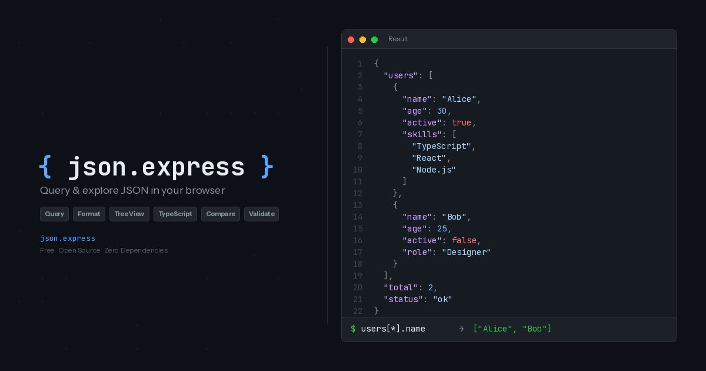
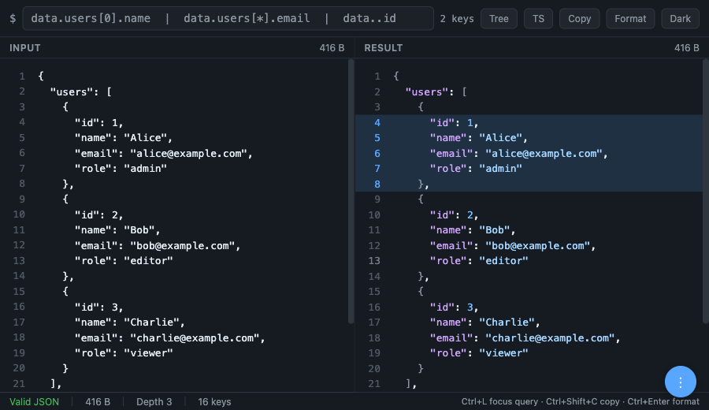

<div align="center">



# { json.express }

**Query, format, compare, and explore JSON — right in your browser.**

A fast, zero-dependency web app for querying, formatting, validating, comparing, and exploring JSON data.
No data ever leaves your browser — everything runs client-side.

[**Open json.express**](https://json.express)

</div>

---

## Features

### Query with Path Expressions

Write queries using dot notation, wildcards, array slicing, and recursive descent to extract exactly the data you need.

```
users[*].name          → collect all names
users[0:2].email       → slice first two emails
..id                   → find all "id" fields recursively
["special-key"]        → bracket notation for special characters
```


### JSON Formatter & Minifier

Format minified JSON into readable, indented output — or minify it back down for production. The lenient parser handles trailing commas, `//` comments, and `/* */` block comments, so config files work out of the box.

### JSON Validator

Validate JSON with both strict (spec-compliant) and lenient modes. Get clear error messages with line and column numbers pointing to exactly where the problem is.

### JSON Diff & Compare

Compare two JSON objects side by side. See added, removed, and changed fields in a diff table — useful for debugging API changes, reviewing config updates, or checking migration results.

### Tree View

Expand and collapse deeply nested objects in a structured tree. Navigate large configs or data dumps without getting lost.


### TypeScript Types

Auto-generate TypeScript interfaces from any JSON. Copy them straight into your codebase.


### Highlight Lines & Comments

Click line numbers in the result panel to highlight lines. Use Shift+Click to select a range, or Cmd/Ctrl+Click to select multiple groups. Click on highlighted lines to add comments. Everything is persisted in the URL for sharing — perfect for code reviews or annotating API responses.



### File Upload

Upload `.json`, `.jsonl`, `.jsonc`, and `.txt` files directly into the editor instead of copy-pasting.

### URL State & Sharing

The entire app state — JSON input, query, highlighted lines, and comments — is compressed into the URL hash using deflate. Bookmark any state or share it with a single link. No server, no database, no accounts.

---

## Tools

json.express includes dedicated tool pages, each optimized for a specific workflow:

| Tool | URL | Description |
|------|-----|-------------|
| **Editor** | [json.express](https://json.express) | Full editor with query, tree view, TypeScript, and more |
| **Format** | [json.express/format](https://json.express/format/) | JSON formatter & beautifier |
| **Validate** | [json.express/validate](https://json.express/validate/) | JSON validator & linter (strict + lenient) |
| **Minify** | [json.express/minify](https://json.express/minify/) | JSON minifier with compression stats |
| **Viewer** | [json.express/viewer](https://json.express/viewer/) | Syntax-highlighted JSON viewer |
| **Tree** | [json.express/tree](https://json.express/tree/) | Collapsible tree viewer |
| **Query** | [json.express/query](https://json.express/query/) | JSON query tool with dot notation & JSONPath |
| **TypeScript** | [json.express/typescript](https://json.express/typescript/) | JSON to TypeScript interface generator |
| **Compare** | [json.express/compare](https://json.express/compare/) | JSON diff & compare tool |

Each tool page includes an interactive demo that works standalone, plus an "Open in Full Editor" button that transfers your data into the main editor.

---

## Blog

Developer guides and tutorials at [json.express/blog](https://json.express/blog/):

- [How to Query Nested JSON Objects Online](https://json.express/blog/how-to-query-json/)
- [JSONPath vs jq — When to Use Which](https://json.express/blog/jsonpath-vs-jq/)
- [JSON Dot Notation Explained with Practical Examples](https://json.express/blog/json-dot-notation/)
- [JSON Array Slicing — Extract Ranges from Arrays](https://json.express/blog/json-array-slicing/)
- [Generate TypeScript Types from JSON](https://json.express/blog/generate-typescript-from-json/)
- [How to Handle JSON with Comments](https://json.express/blog/json-with-comments/)
- [Debugging API Responses — A Developer's JSON Workflow](https://json.express/blog/debugging-api-responses/)
- [JSON Config Files — Patterns, Pitfalls, and Validation](https://json.express/blog/json-config-files/)
- [Exploring package.json — Querying Your Node.js Project Metadata](https://json.express/blog/exploring-package-json/)
- [Working with JSON in CI/CD Pipelines](https://json.express/blog/json-in-cicd-pipelines/)
- [Transforming API Data for Your Frontend](https://json.express/blog/transforming-api-data-frontend/)

---

## Query Syntax

The query bar supports a rich path expression language:

| Expression | Description |
|---|---|
| `users[0].name` | Dot notation and array indexing |
| `users[*].email` | Wildcard to collect from all items |
| `users[0:3]` | Array slicing |
| `..id` | Recursive descent to find all `id` fields |
| `["special-key"]` | Bracket notation for special characters |

## More Features

- **Lenient Parser** — Handles trailing commas, `//` comments, and `/* */` block comments.
- **Copy Result** — One-click copy of the query result.
- **Download** — Export results as `.json` or TypeScript types as `.d.ts`.
- **QR Code** — Generate a QR code for the current URL to scan from another device.
- **Light & Dark Themes** — Follows your system preference, or toggle between light, dark, and system modes.
- **Works Offline** — json.express is a PWA. Once loaded, it works without an internet connection.
- **Zero Dependencies** — Single HTML file. No build step. No frameworks.

## Architecture

- **Single file**: The main editor is entirely in `index.html` (~2,000 lines). No build step, no bundler.
- **Zero dependencies**: Vanilla JS, no frameworks or libraries.
- **Landing pages**: Each tool has its own page with `shared.css` for consistent styling.
- **Blog**: Markdown posts in `scripts/blog-posts/`, built to HTML via `scripts/build-blog.mjs`.
- **Deployed via GitHub Pages** with CNAME pointing to `json.express`.

## Development

```bash
# Just open the file — no build step needed
open index.html

# Or serve locally
python3 -m http.server 8080

# Rebuild blog posts after editing markdown
node scripts/build-blog.mjs
```

## Feedback

Found a bug? Have an idea for a new feature? [Open an issue](https://github.com/uditalias/json.my/issues/new) — all feedback is welcome.

## License

[MIT](LICENSE) — Udi Talias
