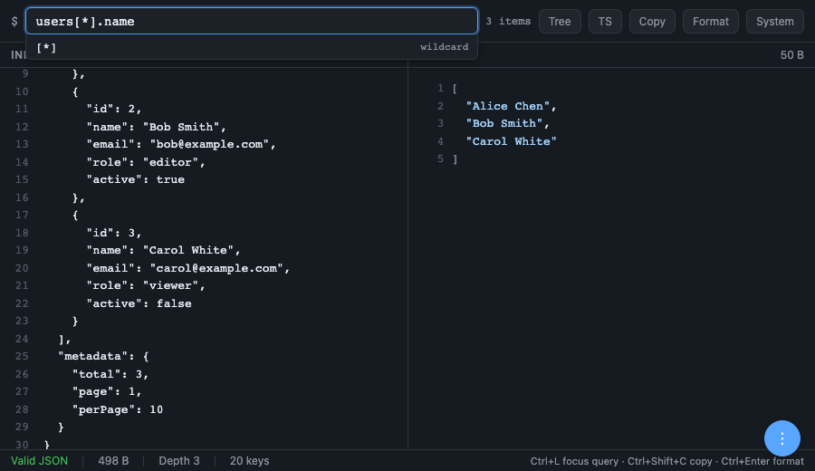
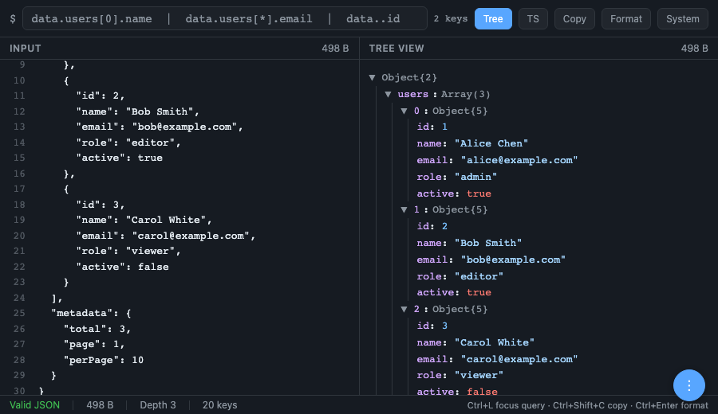
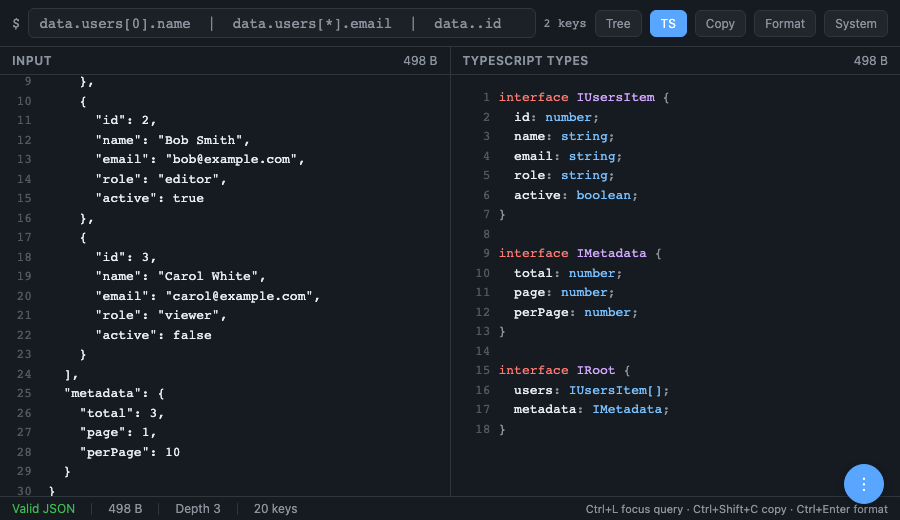

<div align="center">


# { json.express }

**Query and explore JSON, right in your browser.**

A fast, zero-dependency web app for querying, formatting, and exploring JSON data.
No data ever leaves your browser — everything runs client-side.

[**Open json.express**](https://json.express)

</div>

---

## Features

### Query with Path Expressions

Write queries using dot notation, wildcards, array slicing, and recursive descent to extract exactly the data you need.

```
users[*].name          → collect all names
users[0:2].email       → slice first two emails
..id                   → find all "id" fields recursively
["special-key"]        → bracket notation for special characters
```



### Tree View

Expand and collapse deeply nested objects in a structured tree. Navigate large configs or data dumps without getting lost.



### TypeScript Types

Auto-generate TypeScript interfaces from any JSON. Copy them straight into your codebase.



---

## What is this

**json.express** is a single-file, zero-dependency web app for working with JSON. Paste any JSON, write a query, and instantly see the result — syntax-highlighted, as a collapsible tree, or as auto-generated TypeScript interfaces.

No data ever leaves your browser. Everything runs client-side — parsing, querying, formatting, and type inference. Your JSON stays yours.

The entire app is compressed into the URL hash, so you can bookmark or share any state with a single link.

## Query Syntax

The query bar supports a rich path expression language:

| Expression | Description |
|---|---|
| `users[0].name` | Dot notation and array indexing |
| `users[*].email` | Wildcard to collect from all items |
| `users[0:3]` | Array slicing |
| `..id` | Recursive descent to find all `id` fields |
| `["special-key"]` | Bracket notation for special characters |

## Use Cases

- **Debug API responses** — Paste a raw API response and drill down to the exact nested field you need. Great for exploring unfamiliar endpoints.
- **Generate TypeScript types** — Switch to the TS view and get instant interfaces from any JSON. Copy them straight into your codebase.
- **Share JSON snippets** — The URL encodes your data and query. Share a link with a teammate instead of pasting blocks of JSON in Slack.
- **Format messy JSON** — Paste minified or poorly formatted JSON and hit Format. Handles trailing commas and comments too.
- **Explore nested structures** — Use the Tree view to expand and collapse deeply nested objects. Navigate large configs or data dumps without getting lost.
- **Works offline** — json.express is a PWA. Once loaded, it works without an internet connection — perfect for flights or flaky Wi-Fi.

## More Features

- **Lenient Parser** — Handles trailing commas, `//` comments, and `/* */` block comments.
- **Copy Result** — One-click copy of the query result.
- **Download** — Export results as `.json` or TypeScript types as `.d.ts`.
- **QR Code** — Generate a QR code for the current URL to scan from another device.
- **Light & Dark Themes** — Follows your system preference, or toggle between light, dark, and system modes.
- **Zero Dependencies** — Single HTML file. No build step. No frameworks.

## Feedback

Found a bug? Have an idea for a new feature? [Open an issue](https://github.com/uditalias/json.my/issues/new) — all feedback is welcome.

## Development

```bash
# Just open the file — no build step needed
open index.html

# Or serve locally
python3 -m http.server 8080
```

## License

[MIT](LICENSE) — Udi Talias
